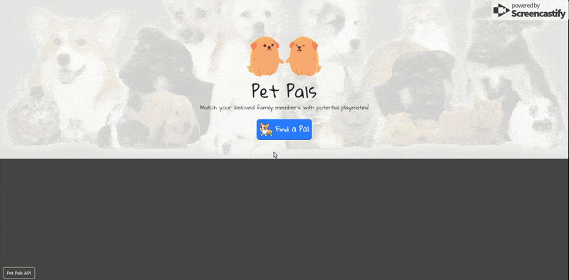
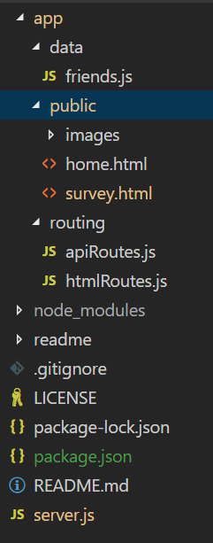

# Pet Pals
[Pet Pals](https://peaceful-dusk-98568.herokuapp.com/)
Fill out the survey and find a friend with similar interests!

## Getting Started

Open up the [project link](https://peaceful-dusk-98568.herokuapp.com/) and you should be able to see the webpage shown below:

Just follow the on screen instructions and fill out the survey to find a new friend for your pet!

If you wish to view the API, there's a link on the bottom left of the home page that will take you to the JSON object of the list of all available pets.

### Prerequisites

You need to have a modern browser able to handle html5, javascript, and css. 

### Installing

No installation needed! Just open the page in your preferred browser.

## Built With

* Html

* CSS

* [Javascript](https://www.javascript.com/) - The scripting language used

* [BootstrapCDN v4.1.0](https://getbootstrap.com/docs/4.1/getting-started/introduction/) - The web framework used

* [jQuery v3.3.1](http://jquery.com/) - Java library for DOM and CSS manipulation

* [Google Fonts](https://fonts.google.com/) - Font repository

* [Node.js](https://nodejs.org/en/) - JavaScript runtime

* [Node Package Manager](https://www.npmjs.com/) - Package manager for JavaScript and Node

* [Express](https://www.npmjs.com/package/express) - Server-side framework

* [Body Parser](https://www.npmjs.com/package/cli-table) - Request parsing middleware

## Challenges

This was my first full stack project! Setting everything up and writing both the code for the server and the webpages was very rewarding. I love vertical integration!

I followed the 

seperate routes into seperate files

## Authors

* **Robert Shaw** - *Initial work* - [robertshaw87](https://github.com/robertshaw87)
